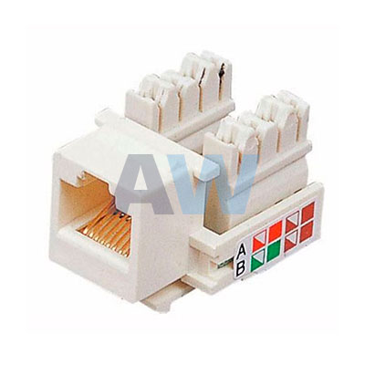
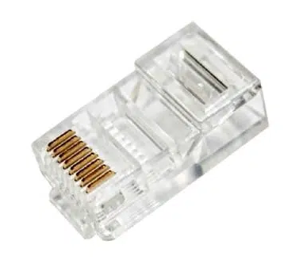
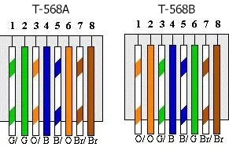

# Conectores

* (con foto) Conector RJ45 Hembra (Jack RJ45)
    El conector RJ45 Hembra es una interfaz física comúnmente utilizada para conectar redes de computadoras con cableado estructurado (categorías 4, 5, 5e, 6, 6a, 7, 7a y 8). Posee ocho pines o conexiones eléctricas, que normalmente se usan como extremos de cables de par trenzado (UTP). 
    
    
    
    * (con foto) Conector RJ45 Macho (ficha RJ45)
    RJ45 es una interfaz física comúnmente utilizada para conectar redes de computadoras con cableado estructurado (categorías 4, 5, 5e, 6, 6a, 7, 7a y 8). Posee ocho     pines o conexiones eléctricas, que normalmente se usan como extremos de cables de par trenzado (UTP).
    
    
    
    * (con foto) Norma T568A y T568B (ficha RJ45 y JackRJ45)
   Para normalizar la disposición de cables, se utilizan dos estándares, el T568A y T568B, los cuales proporcionan esquemas de cableado para la terminación de los cables de red en enchufes. 
    
    
    
    * Cable Cruzado vs Cable Derecho
   Un cable cruzado se usa para conectar dos dispositivos del mismo tipo, como por ejemplo un PC a otro PC o un switch a otro switch. Y el cable directo conecta dos dispositivos diferentes entre sí, como por ejemplo un PC a un switch.
   
[inicio](README.md)
